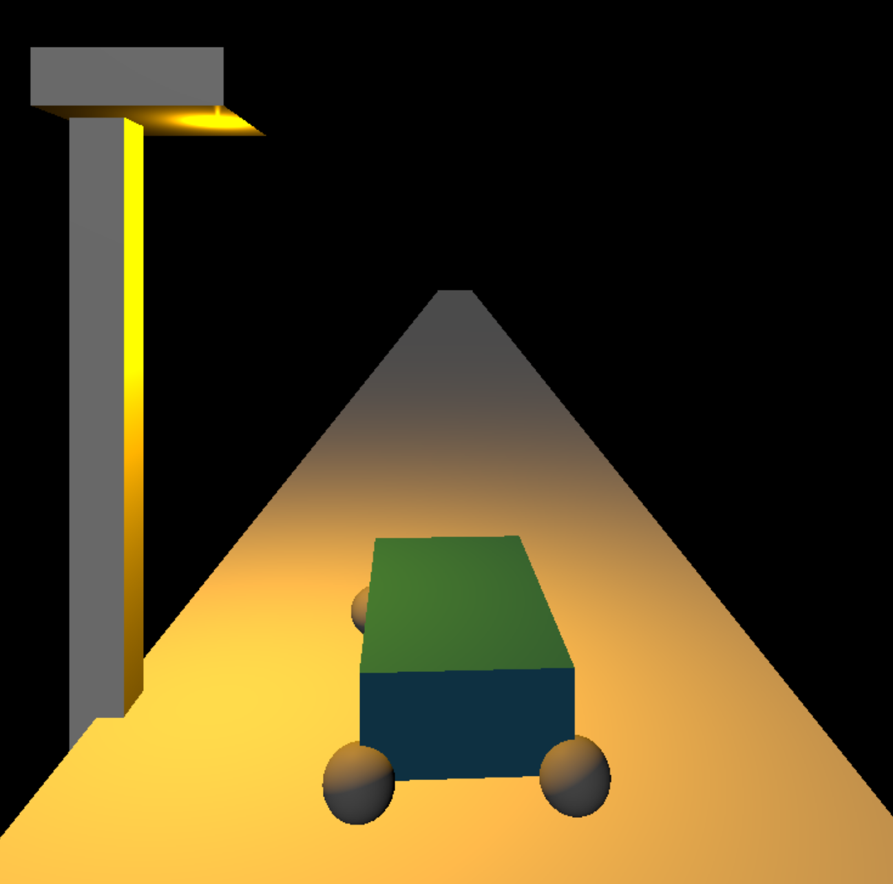

# raicing-one
A game demo to train an AI to drive in a 3D environment

# Current Functionalities
**Currently in ALPHA**
- A rudimentory 3D car with driving physics
- A road
- A street light
- A camera following the car
- Renderer dynamically resizing

## WebSocket API (`/ai`)

The simulator connects to the FastAPI backend via the `ws://localhost:8000/ai` WebSocket endpoint.

**Server → client payload**

```json
{
  "driving_inputs": ["LEFT", "FORWARD"],
  "reward": -12.5,
  "tags": ["DANGEROUS_SIDE", "APPROACHING_EDGE"],
  "training": {
    "count": 42,
    "last": "2025-10-18T22:31:23.000+00:00"
  }
}
```

- `driving_inputs`: ordered list of commands to apply on the current frame (mandatory).
- `reward`: last reward computed for the previous transition. Absent on reset messages.
- `tags`: optional list of contextual tags describing the previous transition. Can be omitted when the server has no relevant tag (e.g. during the initial reset).
- `training`: metadata about the training state (unchanged from previous versions).
